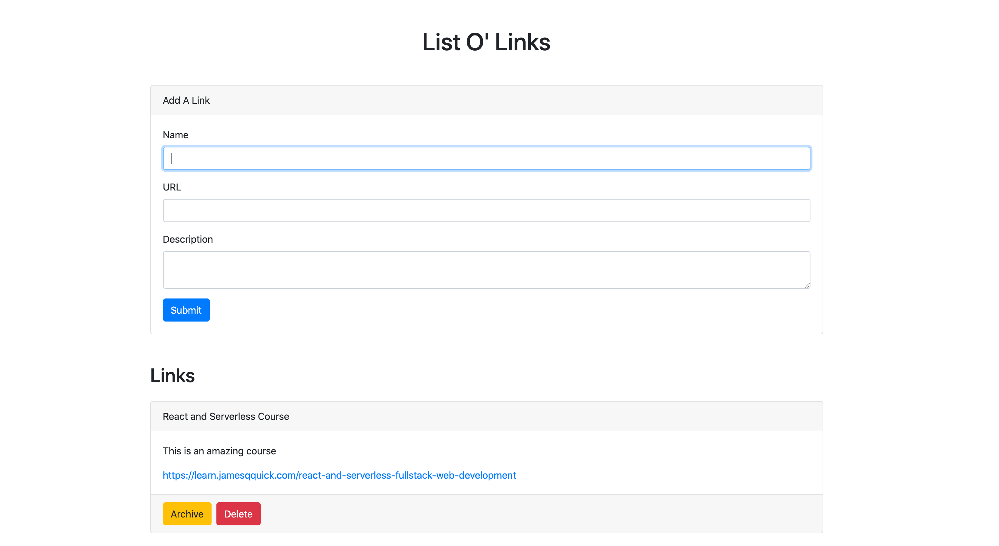

# JAMstack Crash Course - Build a Fullstack App with React, Serverless, and FaunaDB

This is the source code for the [JAMstack Crash Course video on
YouTube]. It uses FaunaDB (with GraphQL), Netlify, and React to build
a fullstack Link Saver application. By the end of the video, you will
have a fully deployed application you can include on your portfolio
and share with your friends.

This project was bootstrapped with [Create React App].

## How to Run

In the project directory, you can run:

### `netlify dev`

To run this app locally, you'll need to install the `netlify-cli`
using `npm install -g netlify-cli`. The React app and the serverless
functions will be served at
[http://localhost:8888](http://localhost:8888).

You'll also need to add a `.env` file in the root directory and
include `FAUNA_SECRET_KEY=<your secret key>`

### `npm run build`

Builds the app for production to the `build` folder.  It
correctly bundles React in production mode and optimizes the build for
the best performance.

The build is minified and the filenames include the hashes.  Your
app is ready to be deployed!

See the section about
[deployment](https://facebook.github.io/create-react-app/docs/deployment)
for more information.

### Deployment

You can connect your repository to Netlify for Contiuous Integration
deployments. In the Netlify deploy configuration, tell Netlify to run
`npm run build` as the command and then serve the `build` directory.

You'll also need to add `FAUNA_SECRET_KEY` environment variable inside
of Netlify dashboard.

<!-- Links -->

[jamstack crash course video on youtube]:
  https://www.youtube.com/watch?v=73b1ZbmB96I
[create react app]: https://github.com/facebook/create-react-app
